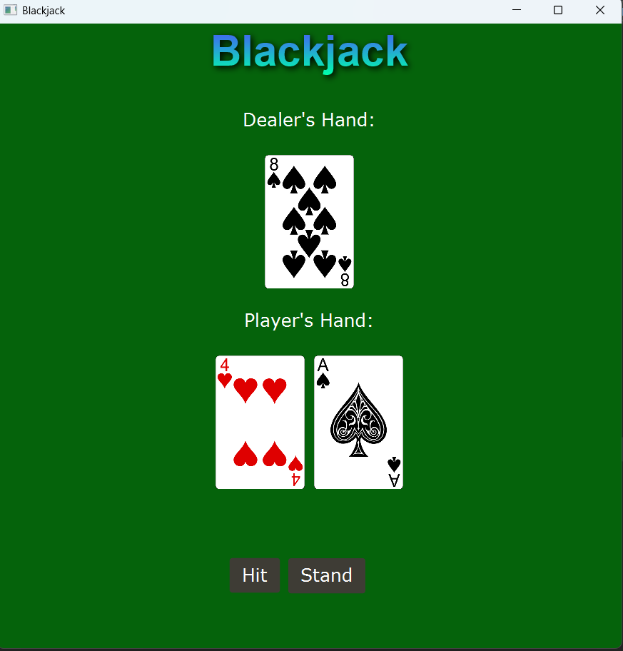
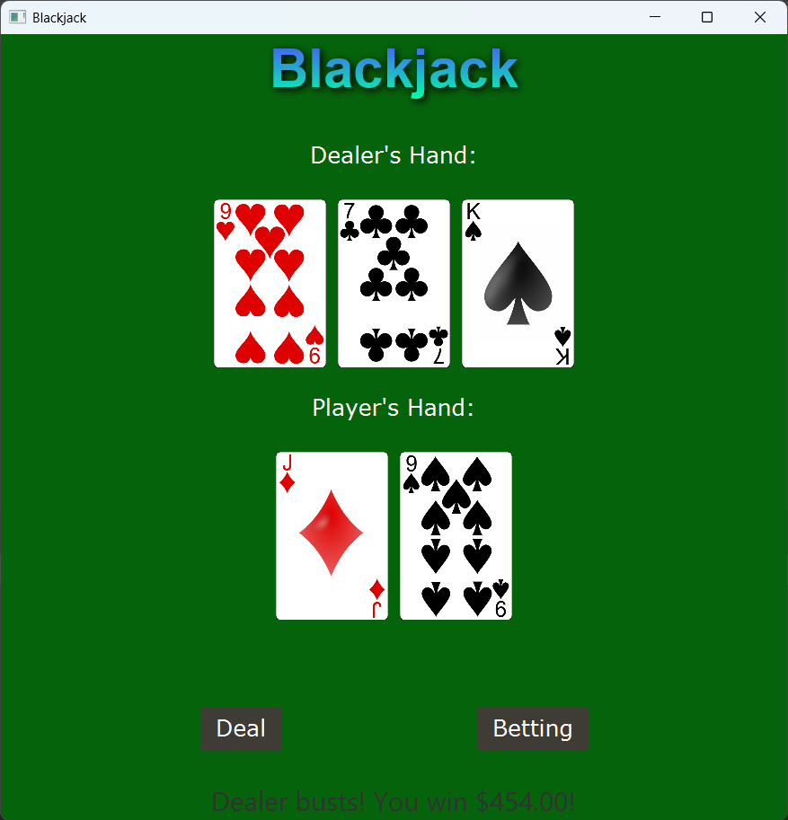
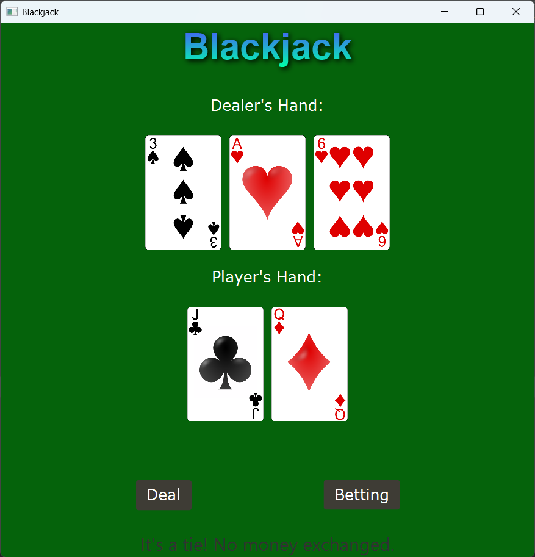
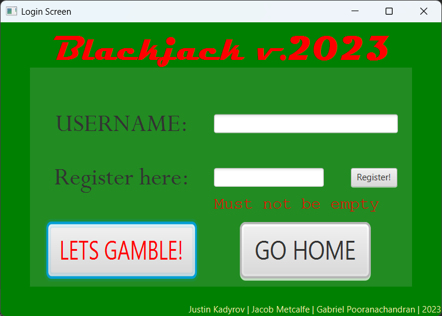

# 🃏 Blackjack Game (JavaFX)

A fully interactive **Blackjack desktop application** built using **Java and JavaFX**, featuring real-time gameplay, betting mechanics, user authentication, and a graphical user interface.

Developed as part of a Software Development & Network Engineering program.

---

## 📸 Screenshots

<p align="center">
  
  
</p>

<p align="center">
  
  
</p>

---

## 🚀 Features

* 🎮 **Full Blackjack Gameplay**

  * Hit, Stand, Deal functionality
  * Dealer logic (hits until 17)
  * Automatic win/loss detection

* 💰 **Betting System**

  * Interactive betting UI using JavaFX
  * Dynamic bet tracking and result calculation
  * Payout logic (Blackjack, win, loss, tie)

* 🔐 **User Authentication**

  * Login and registration system
  * File-based username storage
  * Input validation and alerts

* 🖥️ **Graphical User Interface**

  * Built with **JavaFX**
  * Real-time card rendering using images
  * Clean and responsive layout

* 🧠 **Game Logic**

  * Object-oriented design (Player, Dealer, Hand, Deck, Card)
  * Hand value calculation (Ace handling included)
  * Game state management

---

## 🏗️ Project Structure

```id="full-structure"
blackjack/
│
├── Main_Login.java         # Entry point (launches login screen)
├── LoginController.java   # Handles login & registration logic
│
├── BlackjackUI.java       # Main JavaFX game UI & controller
├── bettingApp.java        # Betting window launcher
├── bettingController.java # Betting system logic
│
├── Player.java            # Player logic (hit, score, UI updates)
├── Dealer.java            # Dealer AI logic (rules-based play)
├── Hand.java              # Manages player/dealer hands & values
├── Deck.java              # Deck creation, shuffle, and dealing
├── Card.java              # Card model (suit, value, images)
│
└── resources/
    ├── cards/             # Card images used in UI
    └── blackjack.fxml     # UI layout files (FXML)
```

---

## 🧩 Key Components

### 🃏 Card, Deck & Hand System

* **Deck**

  * Dynamically generates 52-card decks (supports multiple decks)
  * Shuffle and deal mechanics implemented
  * Auto-reshuffles when empty

* **Hand**

  * Stores player/dealer cards
  * Calculates hand values with **Ace adjustment logic**
  * Supports adding/removing/resetting cards

* **Card**

  * Enum-based suit and value system
  * Handles card image rendering for UI

---

### 👤 Player & Dealer Logic

* **Player**

  * Hit functionality with UI updates
  * Score calculation based on hand
  * Integrated with betting system

* **Dealer**

  * Follows Blackjack rules:

    * Hits until ≥ 17
  * Fully automated gameplay behavior

---

### 💸 Betting System

* JavaFX-based UI controller
* Handles:

  * Bet placement
  * Balance tracking
  * Win/loss payouts

---

### 🔐 Login System

* File-based authentication (`usernames.txt`)
* Register and login functionality
* Alert-driven validation system
* Launches main game upon successful login

---

### 🖥️ JavaFX UI

* Built with **FXML + JavaFX**
* Responsive layout using `HBox`, `StackPane`, etc.
* Real-time updates for:

  * Cards
  * Scores
  * Game state

---

## 🛠️ Technologies Used

* **Java**
* **JavaFX**
* **FXML**
* **Object-Oriented Programming (OOP)**

---

## ▶️ How to Run

1. Clone the repository:

   ```bash
   git clone https://github.com/yourusername/blackjack-game.git
   ```

2. Open in IDE (IntelliJ / Eclipse recommended)

3. Configure JavaFX:

   ```
   --module-path /path/to/javafx/lib --add-modules javafx.controls,javafx.fxml
   ```

4. Run the application:

   ```
   Main_Login.java
   ```

---

## 👨‍💻 Author

**Justin Kadyrov**
Software Development & Network Engineering Graduate
AWS Certified Solutions Architect – Associate (SAA-C03)
